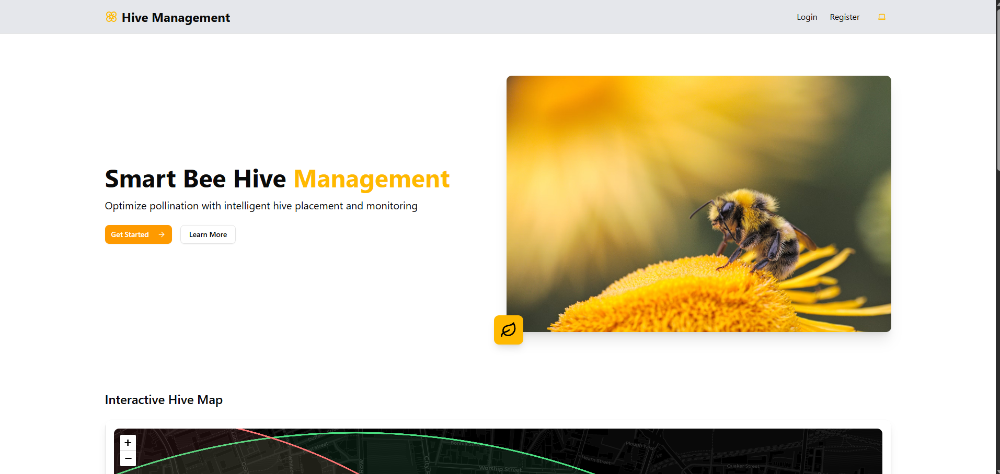

Here’s an improved and well-indented version of your README file with better grammar, consistent formatting, and enhanced clarity. The content remains the same as you requested:

# 🐝 BeeTrail - Hive Management System

A full-stack beekeeping field logging application to help beekeepers manage hive placements and monitor pollination opportunities.

---



## 🔗 Live URLs


- Frontend: 🔗  
 https://bee-hive-tracker.vercel.app/
- Backend: 🔗    
https://beehivebackend-production.up.railway.app/api

---

## 🧪 Dummy Credentials (If you don't want to create an account)

### Admin Access
- **Email**: `ashish.rohilla@decimal.com`
- **Password**: `Ashish@3d21`

### Beekeeper Access
- **Email**: `ashishrohilla510@gmail.com`
- **Password**: `Ashish@3d21`

---

## 🏗 Project Infrastructure

- **Project Type**: Monolithic
- **Frontend**: Next.js 15 (App Router)
- **Backend**: Node.js + Express.js
- **Database**: MongoDB (hosted on Railway via Docker)
- **Containerization**: Docker + Docker Compose
- **Deployment**:
  - Frontend: Vercel
  - Backend: Railway.app
  - Database: Railway.app (MongoDB Docker image)

---

## 🚀 Features

- 🌍 Log hive placements with geolocation (latitude, longitude)
- 📅 View hive logs with date filtering and pagination
- 📥 Export hive logs to CSV
- 🧑‍🌾 Role-based login for **admin** and **beekeeper**
- 📊 Crop-pollination opportunity matching (geo-based, coming soon)
- 💻 Admin UI with ShadCN (forms, tables, cards, buttons)
- 🔐 Private routes ensure secure login for both admin and beekeeper

---

## 🔐 JWT Authentication

- Implemented JWT authentication for both server and client
- Secured private routes accessible only to authenticated and authorized users

---

## 📡 API Endpoints

### Auth
- `POST /register` — Registers user with email, password, and role (default: beekeeper)
- `POST /login` — Authenticates user and returns a JWT token

### Hives
- `POST /api/hives/createhive` — Create a hive
- `GET /api/hives/gethive` — Get all hives

### Crops
- `POST /api/crops/createcrop` — Create a crop location (requires type, latitude, longitude)
- `POST /api/crops/nearyby` — Get nearby crops (requires latitude and longitude)

📤 Export logs to an Excel file by logging in with a beekeeper account.

---

## 🧰 Tech Stack

| Layer      | Technology                          |
|------------|--------------------------------------|
| Frontend   | Next.js 15, ShadCN, Tailwind CSS     |
| Backend    | Node.js, Express.js                 |
| Database   | MongoDB (via Docker)                |
| Infra      | Docker, Docker Compose              |
| Deployment | Vercel (Frontend), Railway (API & DB) |

---

## ⚙️ Local Development Setup

> Ensure you configure `.env` files for both frontend and backend using the provided `env.example`.

---

### 🐳 Docker: Frontend

```bash
cd beehive-tracker/frontend/beehivetracker

# Build Docker image
docker build -t beehivetracker .

# Run container
docker run -d -p 3000:3000 --name beehive-frontend beehivetracker

# Verify running containers
docker ps
```

Expected Output:

```
CONTAINER ID   IMAGE            COMMAND                  PORTS                    NAMES
b7c2c3fb222d   beehivetracker   "docker-entrypoint.s…"   0.0.0.0:3000->3000/tcp   beehive-frontend
```

---

### ▶️ Run Frontend Locally (Without Docker)

```bash
cd beehive-tracker/frontend/beehivetracker

npm install
npm run dev
```

---

### 🐳 Docker: Backend

```bash
cd beehive-tracker/backend

# Build Docker image
docker build -t beehivetrackerbackend .

# Run container
docker run -d -p 5000:5000 --name beehivetrackerbackend beehivetrackerbackend

# Verify running containers
docker ps
```

Expected Output:

```
CONTAINER ID   IMAGE                   COMMAND                  PORTS                    NAMES
5175a41f118d   beehivetrackerbackend   "docker-entrypoint.s…"   0.0.0.0:5000->5000/tcp   beehivetrackerbackend
```

---

### ▶️ Run Backend Locally (Without Docker)

```bash
cd beehive-tracker/backend

npm install
npm start
```

Backend should now be live at: `http://localhost:5000`

---

## 🧪 Other Skills & Interests

### 💻 Recently Learning:
- **Go (Golang)** — building innovative enterprise-grade cloud solutions
- **DevOps & Infrastructure**:
  - Docker, Kubernetes, Helm
  - Jenkins (CI/CD pipelines)
  - Ansible, Terraform (Infra as Code)
  - Linux, Bash scripting, Argo CD

### ⚙️ Hardware Hobbies:
- 3D Designing & Printing
- Tinkering with Arduino, Raspberry Pi, NodeMCU

---

## 🚀 Projects & Work

- **Diana Sentinel** (Internship project): Employee monitoring system with Django REST API + React frontend + desktop screenshot capture client  
  🔗 [https://www.dianasentinel.com/login](https://www.dianasentinel.com/login)

- **Hardware Garage**: Blogging + course platform with node-based editor like Medium  
  🔗 [https://hardwaregarage-git-main-ashurohillas-projects.vercel.app/](https://hardwaregarage-git-main-ashurohillas-projects.vercel.app/)

- **My Kaksha**: Community newsletter builder + content selling platform  
  🔗 [https://my-kaksha-by-ashish.vercel.app/](https://my-kaksha-by-ashish.vercel.app/)

- **Portfolio**:  
  🔗 [https://ashish-rohilla.web.app/](https://ashish-rohilla.web.app/)

- **Agency Page (ScaleSaaS)**:  
  🔗 [https://scale-saas.vercel.app/](https://scale-saas.vercel.app/)

- **3D Website**:  
  🔗 [https://peakyypages.vercel.app/](https://peakyypages.vercel.app/)

- **Freelance Work**:  
  🔗 [https://www.homefinderr.com/](https://www.homefinderr.com/)

---

## 📬 Contact

- **Email**: ashishrohilla510@gmail.com  
- **Phone**: +91 95883 68052  
- **LinkedIn**: [Ashish Rohilla](https://www.linkedin.com/in/ashish-rohilla-3200011ba/)

---

## 🐳 Docker Compose

```bash
docker-compose up --build
```

- Frontend: `localhost:3000`
- Backend: `localhost:5000`
- MongoDB: `localhost:27017`

> ⚠️ Make sure `.env` variables are set properly. Uncomment local variables if necessary.
```

Let me know if you want to split this into multiple README sections for frontend/backend, or generate Markdown with a TOC, badges, or GitHub-compatible enhancements.